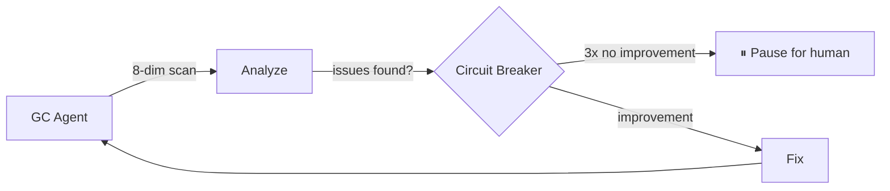
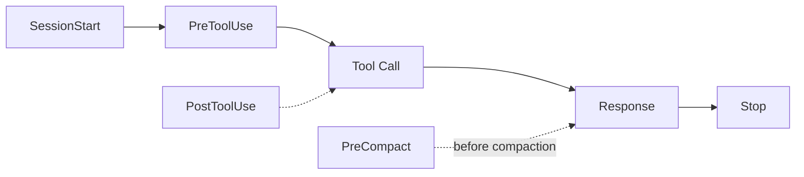

<div align="center">

# Harness Starter

A ready-to-use Claude Code Harness Engineering template  
Works with both new and existing projects

<p>
  
  
  
</p>

> Other platforms (Cursor, Codex, Gemini, etc.): just tell your AI "adapt this template to my environment"

<br>

https://github.com/chenklein26-maker/Harness-Starter

[Xiaohongshu](https://www.xiaohongshu.com/user/profile/5c63da27000000001202556a)

</div>

---

## ✨ What's New: Loop Engineering

This release introduces a **complete Loop automation system** — evolving from "human-driven AI" to "system-driven AI":

| Feature | Description |
|---------|-------------|
| 🔁 **GC Autonomous Scan** | `node scripts/gc-scan.mjs` — 8 deterministic dimensions, no AI self-reporting |
| ⏱ **Scheduled Loops** | `/loop 24h "node scripts/gc-scan.mjs"` — zero-touch operation |
| 🛑 **Circuit Breaker** | 3 consecutive no-improvement runs → auto-pause, waits for human |
| ✅ **Maker/Checker Separation** | The coding agent doesn't grade its own work; `verify-goal` validates independently |
| 📊 **State Persistence** | `STATE.md` (hot, auto-loaded) + `LOG.md` (cold, on-demand) |
| 🧩 **3 Loop Templates** | Daily health check, PR babysit, self-evolution — ready to use |
| 📋 **Audit Trail** | Every Stop triggers a review report, accumulated by date in `.claude/reviews/` |



> Full docs → `.claude/skills/harness-gc/SKILL.md` · Loop templates → `.claude/references/loop-templates.md` · Maturity roadmap → `.claude/references/maturity-roadmap.md`

---

## Design

Every new project requires repeating the same rules to the AI: tech stack, test commands, files to avoid.

Harness Starter automates this through hooks. Install once, use across all projects.

---

## Quick Start

### Option 1: Let AI Set It Up (Recommended)

Tell Claude Code:

```
Initialize this project with Harness Starter
```

The AI will:
1. Clone the template from GitHub
2. Detect your project's tech stack
3. Fill in CLAUDE.md, install Language Server
4. Run health check to confirm everything is ready

### Option 2: npm Install

```bash
npx harness-starter              # Install to current dir
npx harness-starter /path/to/proj  # Install to target dir
npx harness-starter --force      # Override existing files
```

Then tell Claude Code `initialize Harness` to complete setup.

### Option 3: Manual Setup

```bash
# Clone the template
git clone https://github.com/<your-org>/Harness-Starter.git /tmp/harness

# Copy to your project
cp -r /tmp/harness/.claude/  /path/to/your-project/.claude/
cp    /tmp/harness/CLAUDE.md /path/to/your-project/CLAUDE.md
cp    /tmp/harness/.lsp.json /path/to/your-project/.lsp.json

# Install language server
npm install -g typescript-language-server   # TypeScript
pip install pyright                         # Python

# Verify
cd /path/to/your-project && node scripts/check.mjs

# Tell Claude Code: initialize Harness
```

---

## Architecture

During a conversation lifecycle, hooks fire automatically in this order:



| Hook | Timing | Purpose | Note |
|------|--------|---------|------|
| SessionStart | New session begins | Inject git status, review history | Loads last 5 reviews |
| PreToolUse | Before tool execution | Safety: .env, dangerous commands | Relaxed in tweak/design mode |
| PostToolUse | After edits | Auto-format code | Check-then-write; skips if already formatted |
| PreCompact | Before context compaction | Preserve session state | Prevents progress loss in long sessions |
| Stop | After each response | Audit changes, generate report | Auto-integrates GC scan results |

> All hooks share a common data layer (`.claude/hooks/lib/harness-context.mjs`),
> eliminating duplicate logic and keeping data reads consistent.

---

## Project Structure

```
your-project/
├── CLAUDE.md                   AI behavior rules (~60 lines, lean)
├── .lsp.json                   LSP configuration
├── package.json                npm distribution
├── vitest.config.js            Test configuration
├── tests/                      54 automated tests
│   ├── gc-scan.test.mjs        GC scanner tests (22)
│   ├── check.test.mjs          Health check tests
│   ├── harness-context.test.mjs Shared lib tests
│   ├── init.test.mjs           Installer tests
│   └── upgrade.test.mjs        Upgrade script tests
│
├── scripts/
│   ├── check.mjs               Health check
│   ├── init.mjs                One-click install (writes version tag)
│   ├── gc-scan.mjs             8-dimension GC scanner
│   └── upgrade.mjs             Smart upgrade (supports --dry-run)
│
├── .claude/
│   ├── settings.json           Hook registration
│   ├── .harness-state          State awareness
│   ├── .harness-version        Template version tag
│   ├── hooks/
│   │   ├── pre-tool-check.mjs  Safety (+ optional OpenSpec check)
│   │   ├── post-tool-check.mjs Auto-formatter (check-then-write)
│   │   ├── session-context.mjs Context injection
│   │   ├── session-review.mjs  Change review
│   │   ├── pre-compact.mjs     Long-session guard
│   │   └── lib/
│   │       └── harness-context.mjs  Shared data layer
│   ├── skills/
│   │   ├── harness-init/       AI setup workflow
│   │   ├── harness-mode/       Workflow modes
│   │   ├── harness-gc/         GC Agent
│   │   ├── tech-review/        Technical decision review
│   │   └── verify-goal/        Goal verification
│   └── references/
│       ├── maturity-roadmap.md     L0-L5 maturity
│       ├── extension-catalog.md    Extension directory
│       ├── goal-definition-guide.md Goal definition guide
│       └── loop-templates.md       Loop automation templates
│
├── .github/
│   └── workflows/
│       └── harness-check.yml   CI check + tests
```

---

## Usage

### AI Setup (Recommended)

Tell Claude Code:

```
Initialize this project with Harness Starter
```

The AI will:

1. **Fetch** the template from GitHub
2. **Copy** `.claude/`, `CLAUDE.md`, `.lsp.json` into your project
3. **Detect** your tech stack from `package.json` / `pyproject.toml` / `go.mod`
4. **Configure** CLAUDE.md placeholders, install Language Server
5. **Verify** with `node scripts/check.mjs`

> If the files are already in your project, just say "initialize Harness."

The full initialization flow is defined in `.claude/skills/harness-init/SKILL.md`.

### Manual Setup

```bash
# 1. Clone template
git clone https://github.com/<your-org>/Harness-Starter.git /tmp/harness

# 2. Copy to project
cp -r /tmp/harness/.claude/  /path/to/your-project/.claude/
cp    /tmp/harness/CLAUDE.md /path/to/your-project/CLAUDE.md
cp    /tmp/harness/.lsp.json /path/to/your-project/.lsp.json

# 3. Install language server
npm install -g typescript-language-server   # TypeScript
pip install pyright                         # Python

# 4. Verify
cd /path/to/your-project && node scripts/check.mjs

# 5. Tell Claude Code: initialize Harness
```

## Maturity Roadmap

| Level | Name | Description |
|:---:|---|------|
| L0 | Bare | No template, manual prompting |
| L1 | Rules | CLAUDE.md + behavior guidelines |
| L2 | Feedback | PreToolUse + SessionStart + Stop |
| **L3** | **Auto-Correction** | **PostToolUse + PreCompact + ≥5 reviews ← Out of the box** |
| L4 | Autonomous 🔧 | gc-scan 0 critical × 3 + Loop updates (built-in) |
| L5 | Loop Engineering 🔄 | External scheduling + Maker/Checker separation (built-in) |

> Details → `.claude/references/maturity-roadmap.md`

---

## Extensions

### Workflow Modes

Three modes that auto-tune review strictness:

| Command | Effect |
|---------|--------|
| `/harness-mode full` | Full checks, all rules active |
| `/harness-mode hotfix` | Emergency fix, skip line/file count |
| `/harness-mode tweak` | Minimal, .env protection only |
| `/harness-phase design` | Relaxed, skip debug residue |
| `/harness-phase fix` | Tightened, warn if >5 files changed |

Stored in `.claude/.harness-state`, injected at SessionStart.

### GC Autonomous Scanning

```bash
# Manual scan
node scripts/gc-scan.mjs

# Scheduled loop (24h interval)
/loop 24h "node scripts/gc-scan.mjs"

# Preview upgrades
node scripts/upgrade.mjs --dry-run
```

8 deterministic dimensions: CLAUDE.md completeness, Git status, TODO/FIXME density, .gitignore health, Hook registration, Harness state, TypeScript errors, LSP config. See `.claude/skills/harness-gc/SKILL.md`.

### Template Upgrade

```bash
# Check and upgrade
node scripts/upgrade.mjs

# Preview only
node scripts/upgrade.mjs --dry-run
```

Version tracking (`.claude/.harness-version`), smart classification of "user-modified" vs "template-original" files.

### Environment Variables

| Variable | Effect |
|----------|--------|
| `HARNESS_POSTTOOL_FORMAT=0` | Disable auto-formatting |
| `HARNESS_POSTTOOL_FORMAT_SKIP_PATTERNS=*.md,*.json` | Skip file types |
| `HARNESS_OPENSPEC_CHECK=1` | Enable OpenSpec awareness |

### Multi-Agent Teams

Split complex tasks across multiple agents for parallel work:
- Explore multiple approaches simultaneously
- Separate frontend/backend/testing into parallel streams
- Isolate long-running tasks from the main conversation

---

## Migration

```bash
cp -r .claude/ CLAUDE.md .lsp.json /path/to/new-project/
```

Edit the first three lines of CLAUDE.md, reinstall the language server, and you're ready to go.

---

<div align="center">

[中文版](README.md) · MIT License

</div>
