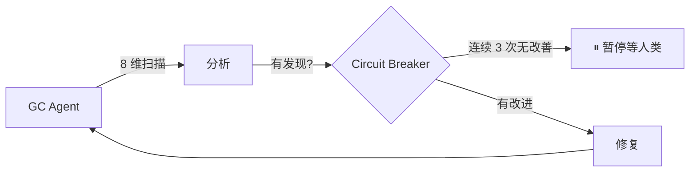
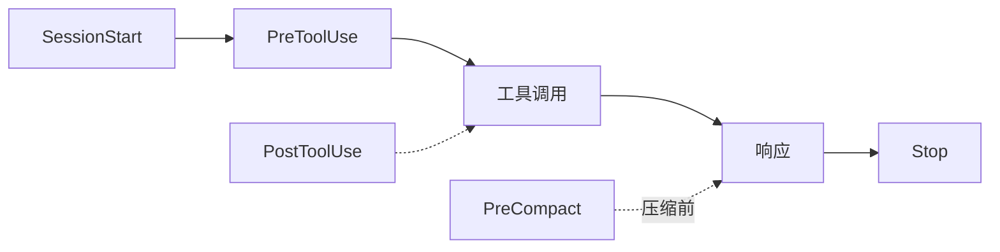

<div align="center">

# Harness Starter

一套开箱即用的 Claude Code Harness Engineering 模板  
新项目和已有项目均可使用

<p>
  
  
  
</p>

> 其他平台（Cursor、Codex、Gemini 等）用户直接告诉 AI：「适配这个模板到我的环境」

<br>

https://github.com/chenklein26-maker/Harness-Starter

[小红书](https://www.xiaohongshu.com/user/profile/5c63da27000000001202556a)

</div>


---

## ✨ 最近更新：Loop Engineering 全面升级

本版本引入了**完整的 Loop 自治循环系统**，从"人驱动 AI"迈向"系统驱动 AI"：

| 特性 | 说明 |
|------|------|
| 🔁 **GC 自治扫描** | `node scripts/gc-scan.mjs` — 8 个维度确定性检查，不依赖 AI 自我报告 |
| ⏱ **定时循环** | `/loop 24h "node scripts/gc-scan.mjs"` — 无需人工触发 |
| 🛑 **Circuit Breaker** | 连续 3 次无改善 → 自动暂停，等你介入 |
| ✅ **执行/验证分离** | 写代码的 Agent 不给自己打分，`verify-goal` 独立验证 |
| 📊 **状态持久化** | `STATE.md`（热，会话自动加载）+ `LOG.md`（冷，按需读取）|
| 🧩 **3 种 Loop 模板** | 每日巡检、PR babysit、自我进化 — 开箱即用 |
| 📋 **审计闭环** | 每次 Stop 触发审查报告，按日期累积至 `.claude/reviews/` |



> 完整说明 → `.claude/skills/harness-gc/SKILL.md` · 循环模板 → `.claude/references/loop-templates.md` · 成熟度路线图 → `.claude/references/maturity-roadmap.md`

---

## 设计思路

每次新建项目或打开已有项目时，都需要反复告诉 AI 同样的规则：技术栈是什么、测试怎么跑、哪些文件不能动。

Harness Starter 把这些重复劳动固化为 Hook 自动化机制。装一次，所有项目通用。

---

## 快速开始

### 方式一：让 AI 帮你安装（推荐）

在 Claude Code 中输入：

```
帮我用 Harness Starter 初始化这个项目
```

AI 会：
1. 从 GitHub 拉取模板文件
2. 检测项目技术栈，填写 CLAUDE.md
3. 安装对应的 Language Server
4. 运行健康检查确认一切就绪

### 方式二：npm 一键安装

```bash
npx harness-starter              # 安装到当前目录
npx harness-starter /path/to/proj  # 安装到指定目录
npx harness-starter --force      # 覆盖已有文件
```

然后 Claude Code 中输入 `帮我初始化 Harness` 完成配置。

### 方式三：手动复制

```bash
# 复制模板文件
cp -r .claude/ CLAUDE.md .lsp.json /path/to/your-project/

# 在 Claude Code 中完成初始化
# 输入：帮我初始化 Harness
```

---

## 整体架构

一条对话的生命周期中，Hook 按以下顺序自动触发：



| Hook | 时机 | 职责 | 备注 |
|------|------|------|------|
| SessionStart | 新对话开始 | 注入 git 状态、历史审查 | 自动加载最近 5 次审查 |
| PreToolUse | 工具执行前 | 安全拦截：.env 保护、危险命令 | tweak/design 模式放宽 |
| PostToolUse | 编辑完成后 | 自动格式化代码 | 先 check 再 write，格式正确则跳过 |
| PreCompact | 上下文压缩前 | 保存会话关键状态 | 防止长会话丢进度 |
| Stop | 每次响应后 | 审查变更、生成报告 | 自动集成 GC 扫描结果 |

> 所有 Hook 共享一个上下文工具库（`.claude/hooks/lib/harness-context.mjs`），
> 消除重复逻辑，保持数据读取一致。

---

## 项目结构

```
your-project/
├── CLAUDE.md                   AI 行为规则（~60 行，精简版）
├── .lsp.json                   LSP 配置
├── package.json                npm 分发
├── vitest.config.js            测试配置
├── tests/                      54 个自动化测试
│   ├── gc-scan.test.mjs        GC 扫描器测试（22 个）
│   ├── check.test.mjs          健康检查测试
│   ├── harness-context.test.mjs 共享库测试
│   ├── init.test.mjs           安装器测试
│   └── upgrade.test.mjs        升级脚本测试
│
├── scripts/
│   ├── check.mjs               安装健康检查
│   ├── init.mjs                一键安装（写入版本标记）
│   ├── gc-scan.mjs             8 维 GC 扫描器
│   └── upgrade.mjs             智能升级（支持 --dry-run）
│
├── .claude/
│   ├── settings.json           Hook 注册
│   ├── .harness-state          阶段/模式感知
│   ├── .harness-version        模板版本标记
│   ├── hooks/
│   │   ├── pre-tool-check.mjs  安全拦截（+ OpenSpec 可选检查）
│   │   ├── post-tool-check.mjs 自动格式化（先 check 再 write）
│   │   ├── session-context.mjs 上下文注入
│   │   ├── session-review.mjs  变更审查
│   │   ├── pre-compact.mjs     长会话保护
│   │   └── lib/
│   │       └── harness-context.mjs  共享数据读取层
│   ├── skills/
│   │   ├── harness-init/       AI 安装向导
│   │   ├── harness-mode/       工作流模式切换
│   │   ├── harness-gc/         GC Agent 技能
│   │   ├── tech-review/        技术方案审查
│   │   └── verify-goal/        目标验证
│   └── references/
│       ├── maturity-roadmap.md     成熟度路线图（L0-L5）
│       ├── extension-catalog.md    扩展功能目录
│       ├── goal-definition-guide.md 目标定义详细示例
│       └── loop-templates.md       外循环模板
│
├── .github/
│   └── workflows/
│       └── harness-check.yml   CI 检查 + 测试
```

---

## 使用方式

### AI 自动安装（推荐）

在 Claude Code 中直接说：

```
帮我用 Harness Starter 初始化这个项目
```

AI 会自动完成全流程：

1. **拉取模板**：从 GitHub 克隆最新版本
2. **复制文件**：将 `.claude/`、`CLAUDE.md`、`.lsp.json` 复制到项目
3. **检测技术栈**：读取 `package.json` / `pyproject.toml` / `go.mod` 等
4. **填写配置**：替换 CLAUDE.md 占位符，安装 Language Server
5. **验证**：运行 `node scripts/check.mjs` 确认一切就绪

> 如果文件已在项目中，直接说「帮我初始化 Harness」即可。

完整的初始化流程定义在 `.claude/skills/harness-init/SKILL.md` 中。

### 手动设置

如果希望手动操作：

```bash
# 1. 克隆模板
git clone https://github.com/chenklein26-maker/Harness-Starter.git /tmp/harness

# 2. 复制到项目
cp -r /tmp/harness/.claude/  /path/to/your-project/.claude/
cp    /tmp/harness/CLAUDE.md /path/to/your-project/CLAUDE.md
cp    /tmp/harness/.lsp.json /path/to/your-project/.lsp.json

# 3. 安装语言服务
npm install -g typescript-language-server   # TypeScript
pip install pyright                         # Python

# 4. 验证
cd /path/to/your-project && node scripts/check.mjs

# 5. 在 Claude Code 中完成初始化
# 输入：帮我初始化 Harness
```

---

## 成熟度路线图

| 级别 | 名称 | 说明 |
|:---:|---|------|
| L0 | 裸用 | 无模板，手动提示 |
| L1 | 规则层 | CLAUDE.md + 行为准则 |
| L2 | 反馈回路 | PreToolUse + SessionStart + Stop 已激活 |
| **L3** | **自动修正** | **PostToolUse + PreCompact + 审查报告 ≥5 份 ← 开箱即用** |
| L4 | 自治系统 🔧 | gc-scan 连续 3 次 0 critical + Loop 持续更新（组件已内置） |
| L5 | 循环工程 🔄 | 外循环调度 + Maker/Checker 分离（组件已内置） |

> 详细说明 → `.claude/references/maturity-roadmap.md`

---

## 扩展功能

### 工作流模式

三种模式自动调整审查严格度。由 `.claude/.harness-state` 驱动：

| 命令 | 效果 |
|------|------|
| `/harness-mode full` | 完整检查，所有规则生效 |
| `/harness-mode hotfix` | 紧急修复，跳过行数/文件数检查 |
| `/harness-mode tweak` | 微调，仅保护 .env |
| `/harness-phase design` | 宽松审查，不检查调试残留 |
| `/harness-phase fix` | 修复模式，>5 个文件变更即告警 |

### GC 自治扫描

```bash
# 手动扫描
node scripts/gc-scan.mjs

# 定时循环（24h 间隔）
/loop 24h "node scripts/gc-scan.mjs"

# 预览模式
node scripts/upgrade.mjs --dry-run
```

8 个确定性扫描维度：CLAUDE.md 完整性、Git 状态、TODO/FIXME 密度、.gitignore 健康、Hook 注册、Harness 状态、TypeScript 类型、LSP 配置。详见 `.claude/skills/harness-gc/SKILL.md`。

### 模板升级

```bash
# 检查并升级
node scripts/upgrade.mjs

# 仅预览变更
node scripts/upgrade.mjs --dry-run
```

版本跟踪（`.claude/.harness-version`），智能区分"用户自定义"和"模板原生"文件。

### 环境变量控制

| 变量 | 效果 |
|------|------|
| `HARNESS_POSTTOOL_FORMAT=0` | 禁用自动格式化 |
| `HARNESS_POSTTOOL_FORMAT_SKIP_PATTERNS=*.md,*.json` | 跳过指定文件类型 |
| `HARNESS_OPENSPEC_CHECK=1` | 开启 OpenSpec 感知检查 |

### 多 Agent 团队

复杂任务可以拆分为多个 Agent 分工协作。适用场景：
- 同时探索多个方案并对比结果
- 前端/后端/测试分离并行
- 长期运行的任务与主会话隔离

---

## 迁移

```bash
cp -r .claude/ CLAUDE.md .lsp.json /path/to/new-project/
```

修改 CLAUDE.md 前三行，重新安装 language server，即可在新项目中使用。

---

<div align="center">

[English](README.en.md) · MIT License

</div>
